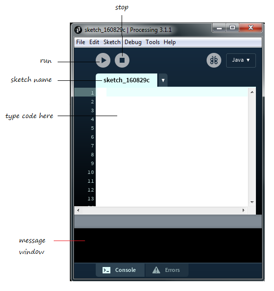
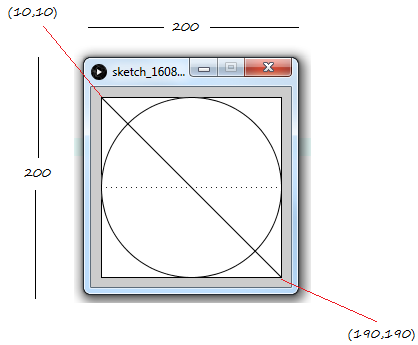
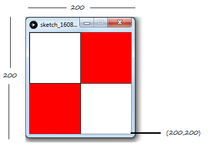
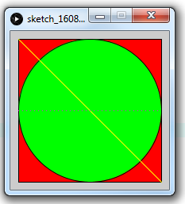
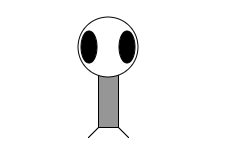
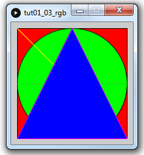

# Exercise #1 - Processing Basics


## Part 1 - Install & Run Processing

1.	Download and install Processing for your PC from this [link](https://processing.org/download/)

1.	Execute/launch *Processing* on your PC.

	You should then see the Processing environment:

	


2.	Run a sample program (aka sketch)

	Choose:

	```
	File> Examples... Basics> Color> Brightness
	```

	and press the *run* button.

	Choose any of the other example programs and run them too.


3.	Create a new folder on your PC or external hard drive called ``psol`` to store all your code for this module.  You should save all your programs there.  You can also change the default sketchbook location using  ``File > Preferences...`` to your new folder.

4.	Download to your ``psol`` folder a new sketch (program) called [tut01_01_shapes](../files/exercises/tut01_01_shapes/tut01_01_shapes.zip?raw=true).  Run the code at notice it uses code like below:

	```java	
	size(300, 200);

	// line
	line(0, 0, 150, 100);

	// rectangle
	rect(150, 0, 300, 100);

	// ellipse
	ellipse(50, 150, 50, 50);

	// point
	point(200, 150);

	println("Some simple shapes");

	```

5.	The program above works because there are no errors in it.
	The program [tut01_02_errors](../files/exercises/tut01_02_errors/tut01_02_errors.zip?raw=true) below has errors.  
	Carefully examine the error messages shown and fix them.

	```java
	size(300, 200);

	// line
	line();

	// rectangle
	rect(150, 0, 300, 100)

	// ellipse
	ellipse(50, 150, 50, 50);

	// point
	POINT(200, 150);

	println("Some simple shapes";
	
	```

## Part 2 - Shapes & Colours

1.	Give the instructions to draw the following output:

	

1.	Give the instructions to draw the following output:

	

1.	Provide the missing RGB values for the colours needed in the code [tut01_03_rgb](../files/exercises/tut01_03_rgb/tut01_03_rgb.zip?raw=true):

	

	```java
	size(200, 200);

	fill(___, ___, ___);          // red 
	rect(10, 10, 180, 180);  

	fill(___, ___, ___);          // green
	ellipse(100, 100, 180, 180);

	stroke(___, ___, ___);        // yellow line
	line(10, 10, 190, 190); 

	stroke(___, ___, ___);        // purple points
	for (int i=10; i<190; i=i+5)
	  point(i, 100);
	 
	```
	You can use a this [Colour Picker](http://www.w3schools.com/colors/colors_picker.asp "Colour Picker") 

1.	Using the template program [tut01_creature](../files/exercises/tut01_creature/tut01_creature.zip?raw=true) create a creature called Zoog using commands like - ```point()```, 
	```line()```, ```rect( )```, ```ellipse()```, ```stroke()``` , and ```fill()```. 

	This is zoog!

	

	You will get to use your creature in later exercises.


## Part 3 - Processing Reference

1.	Using the [Processing Reference](https://processing.org/reference/ "Processing Reference"), try to draw a triangle in the program [tut01_03_rgb](../files/exercises/tut01_03_rgb/tut01_03_rgb.zip?raw=true) using the ``triangle()`` method.  
	It should then look like this:

	 

2.	Use the reference to find a method that sets the thickness of lines drawn around shapes.
	Modify the code above to draw a line 10 pixels wide aound the triangle.


