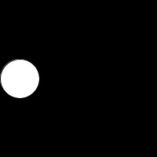
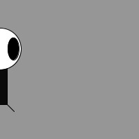
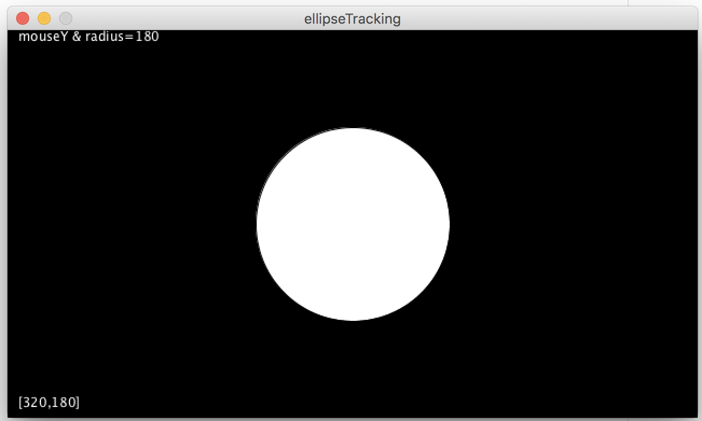

# Exercise #2 - Processing Flow, Variables & Events

## Part 1 - Program Flow

1.	Run the program [ellipse_moving](../code/notes/ellipseMoving/ellipseMoving.zip?raw=true).

2.	Modify the code so the ellipse moves twice as fast across the screen.

3.	Comment out the ``background()`` method and run the code again.
	Can you explain why you see a trail of ellipses.  Restore the background when finished.

4.	Modify the code so a second red coloured ellipse starts at the right hand side and moves from right to left across the canvas.  Comment it out when done.

5.	Modify the code so the white ellipse *bounces* off the sides of the canvas continuously like this:

	

6.	Modify your creature so it moves across the canvas once like zoog below:

	

## Part 2 - Built-In Variables

1.	Run the program [ellipse_tracking](../code/notes/ellipseTracking/ellipseTracking.zip?raw=true).

1.	Modify the code so the radius of the ellipse uses the current mouse y location.
	Restore the ellipses width and height to 50 when done.

1.	Modify the code so the ellipse uses both the x and y location of the mouse for its x,y coordinates.

1.	Modify the code to print the `mouseX` and `mouseY` coordinates at the bottom left corner of the window.  Like this:

	

	Check out the ``text()`` function [here](https://processing.org/reference/text_.html) to see how to print text on the window.

1.	Uncomment the ``background()`` method in ``setup()`` and comment out ``background()`` method in ``draw()`` run the code again.	Can you explain why you see a trail of ellipses.  Restore the backgrounds when finished.

1.	Run the program [tut01_04_lineDrawing](../files/exercises/tut01_04_lineDrawing/tut01_04_lineDrawing.zip?raw=true). Uncomment the ``background()`` method in ``draw()`` and run the code again.  Again understand when this effect is happening.

1.	Create a new program ``ex2_creature_tracking`` that uses both the x and y location of the mouse for the x,y coordinates of your creature.

## Part 3 - Processing Events

1.	Run the program [ellipse_mouse](../code/notes/ellipseMouse/ellipseMouse.zip?raw=true)

	Modify the code in ``keyPressed()`` so when the key 'r' is pressed the colour **r**ed will be used next time an ellipse is drawn.  Hint: Use the [``fill()``](https://processing.org/reference/fill_.html "fill()") method.

2.	Modify the code to also use the 'g' and 'b' keys for green and blue.

