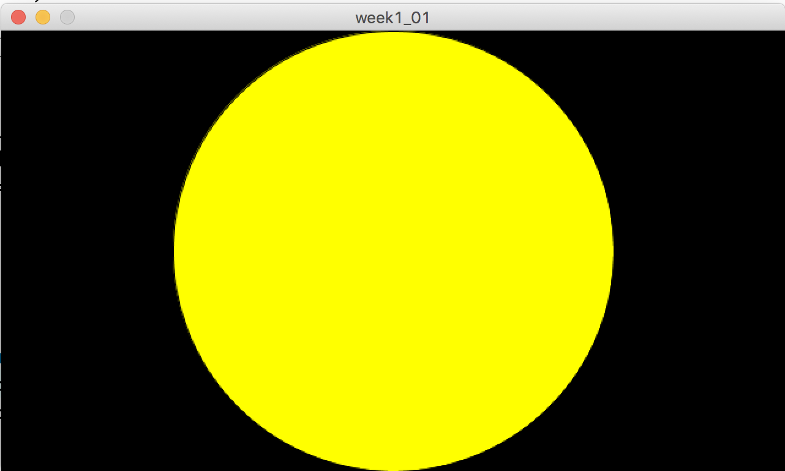
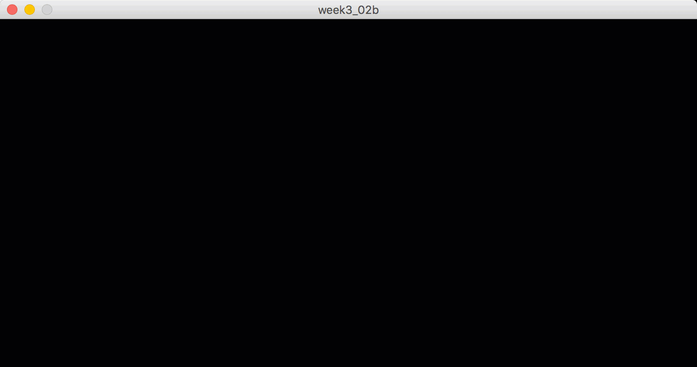
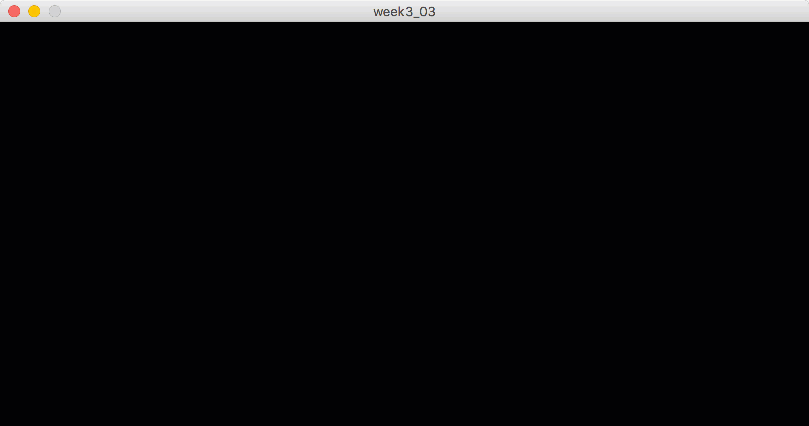
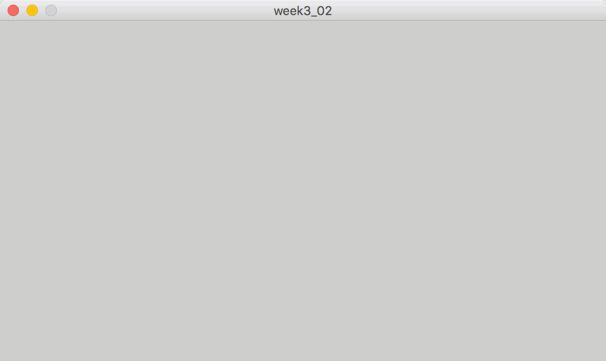
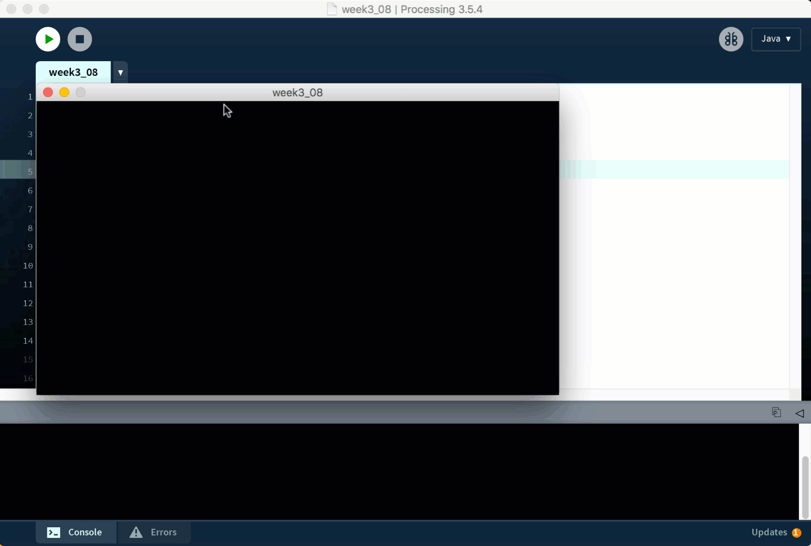

# Exercise #3 - Variables, random(), println()

## Part 1 - Variables

1.	Open and examine the program [week3_01](../files/exercises/week3_01/week3_01.zip?raw=true).  

1.	Update the code so a new variable ``circleY`` is declared, initialised and eventually used in the ``ellipse()`` function.  Make sure you declare and initialise the variable in the correct locations within the code.

1.	Update the code so the circle drawn is red.  Use the ``circleColour`` variable.  

1.	Update the code so the circle drawn looks like this:

	

## Part 2 - random()

1.	Create a new project called `week3_02` that displays white circles with a radius of 25 pixels at random locations on a 800 x 400 window, like this:

	

1.	Create a new project called `week3_03` that displays random coloured circles with a radius of 25 pixels at random locations on a 800 x 400 window, like this:

	

1.	Create a new project called `week3_04` that displays random coloured circles with a random radius of between 1 and 25 pixels at random locations on a 800 x 400 window, like this:

	

1.	Create a new project called `week3_05` that displays random coloured lines with random lengths inside a 800 x 400 window, like this:

	

1.	Create a new project called `week3_06` that draws a line from one random coordinate to another inside a 800 x 400 window, like this:

	

	The line drawn is continuous.

1.	Create a new project called `week3_07` that draws a single bubble inside a 800 x 400 window, like this:

	

	The program only needs to draw one bubble, but it has the following random features:
	-	a random radius  between 1 and 50
	-	a random original `x` position 
	-	a jitter effect along `x` as it floats upwards
	-	a white light source reflection
	

## Part 3 - println()

1.	Create a new project called `week3_08` that prints the (x,y) coordinate in the console window when you click inside the main window:

	
