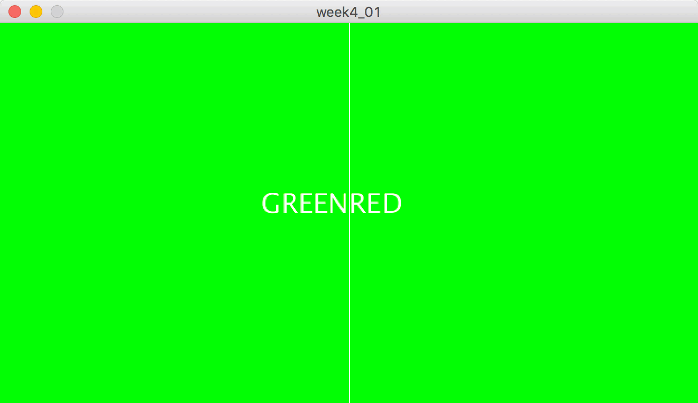
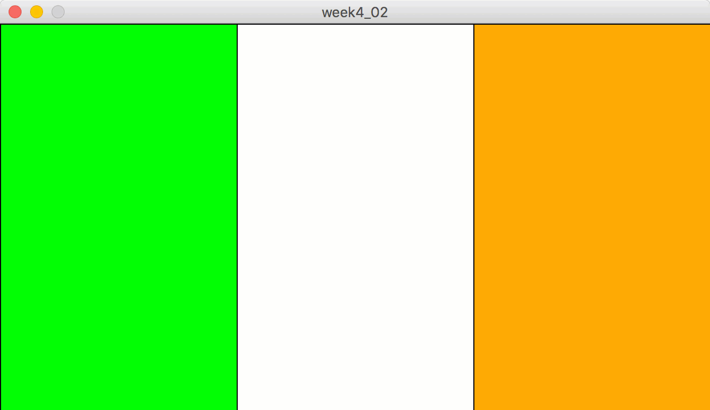
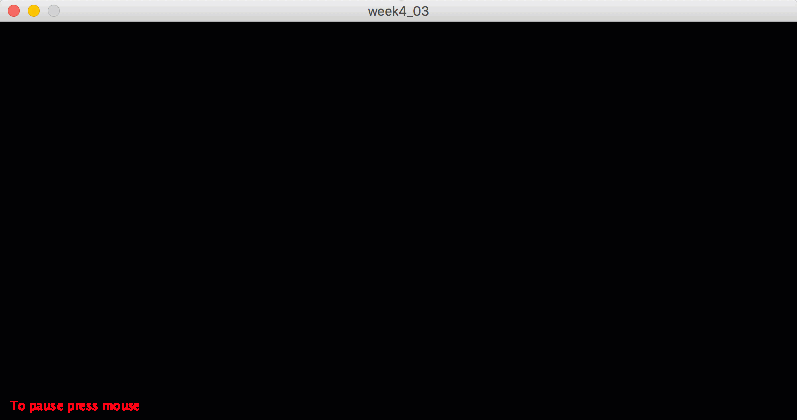
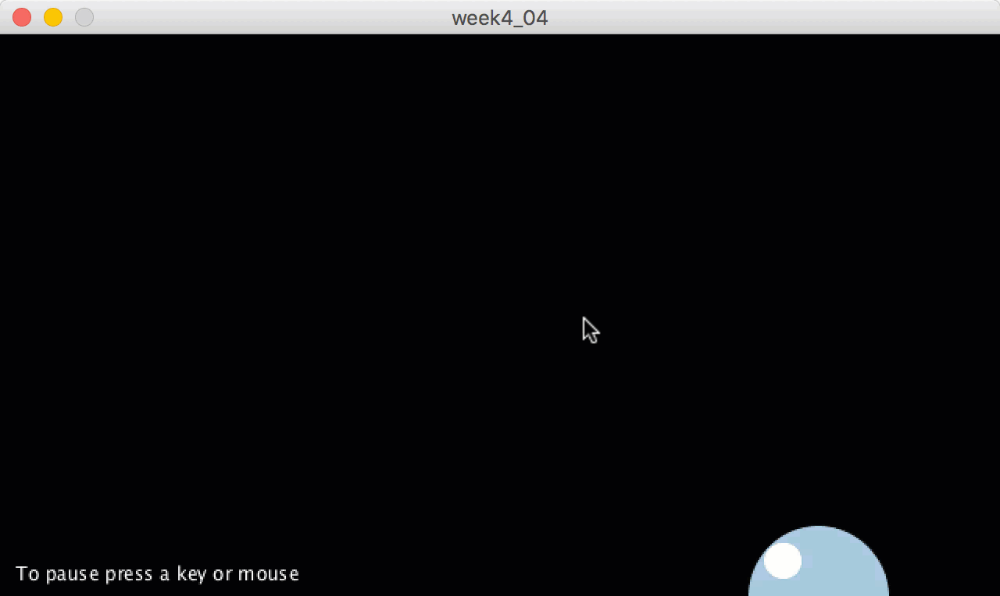
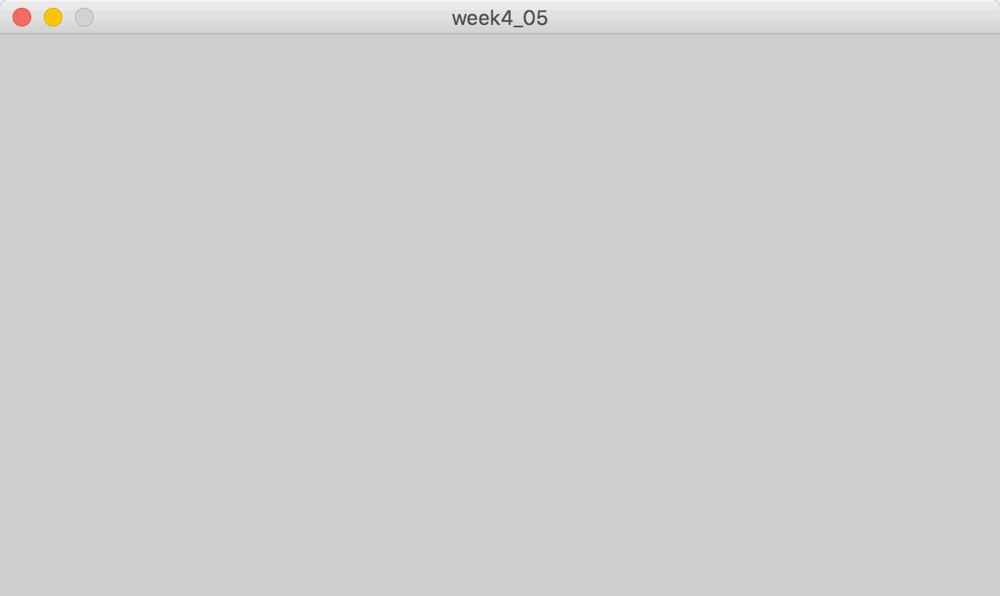
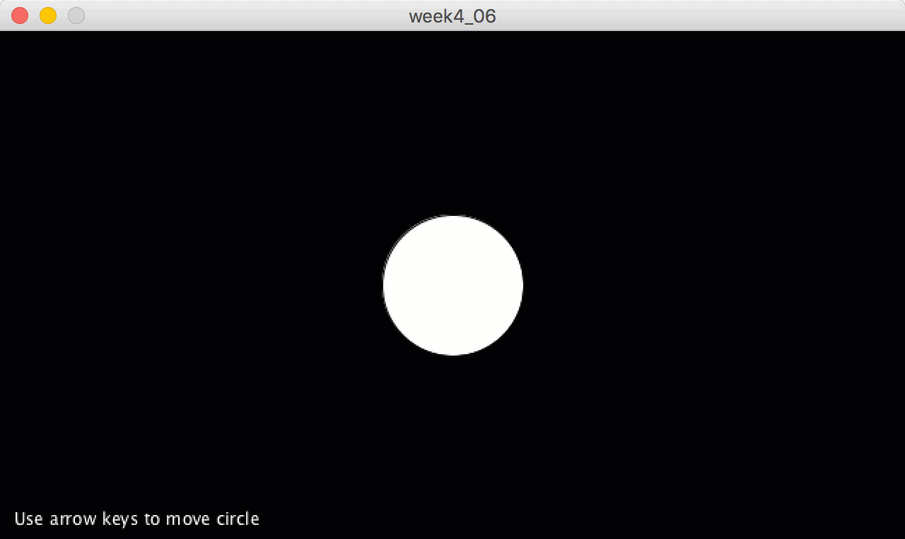

# Exercise #4 - Conditionals (if statement)

## Part 1

1.	Create a new project called `week4_01` that draws a line down the middle of a 660 x 360 window and use the mouse position either side of this line to draw a green or red background like this:

	

1.	Create a new project called `week4_02` that displays a tricolour in a 660 x 360 window and then colours a segment of the tricolour black using the mouse like this:

	

1.	Create a new project called `week4_03` that displays random white circles at random locations on a 800 x 400 window but can be paused and resumed using a mouse click like this:

	

1.	Update your project called `week3_07` that displays the floating bubble.  Use the mouse click **or** a keyboard key press to pause and resume the bubble floating up the window like this:

	

1.	Create a new project called `week4_05` with a ball/circle moving around and bouncing from the edges of a 640 x 360 window, like below.  Use a mouse click to pause and resume the ball moving.

	

1.	Create a new project called `week4_06` that draws a circle in the middle of a 640 x 360 window.  Allow the circle movement to be controlled using the keyboard arrow keys.  Use the Processing reference [here](https://processing.org/reference/keyCode.html) to help code your solution.

	

