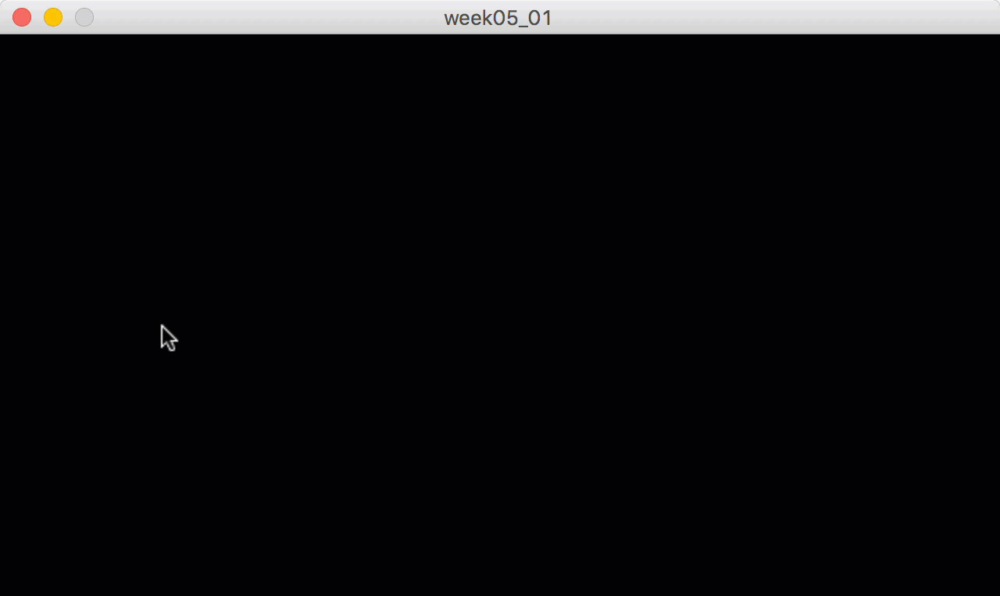
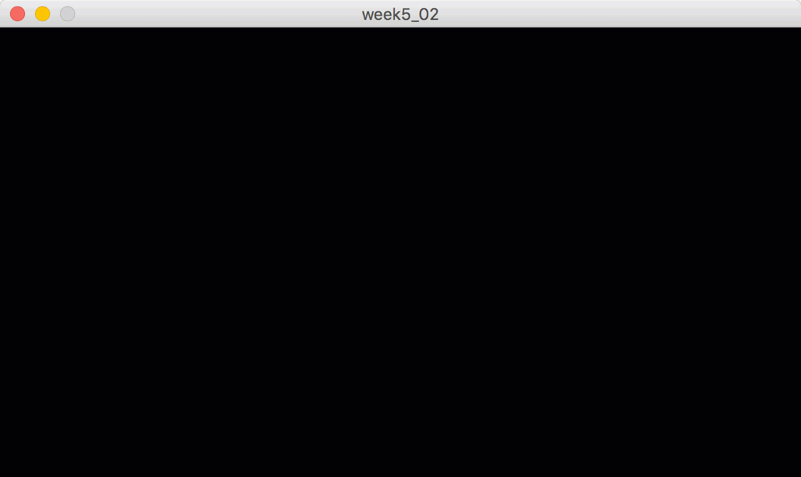
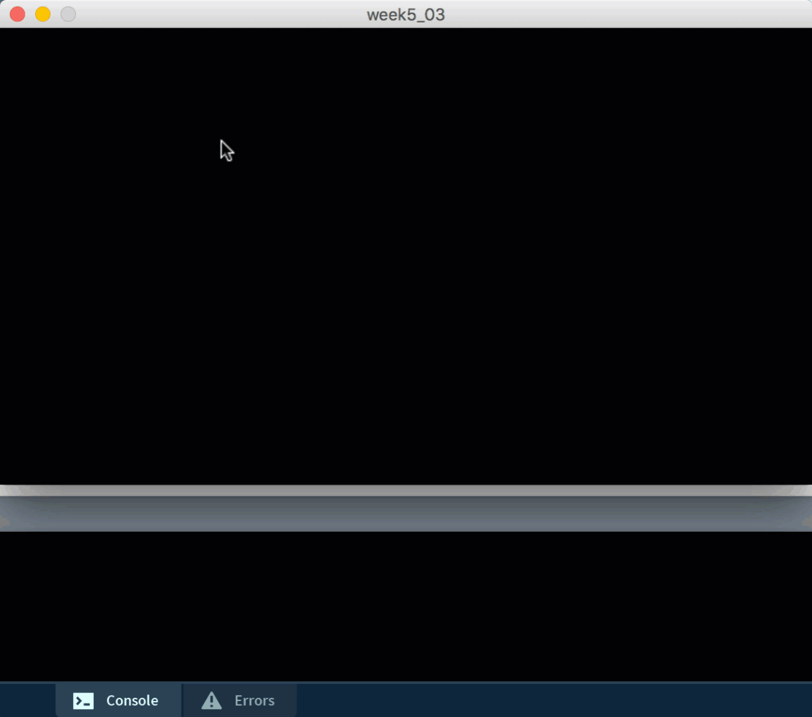
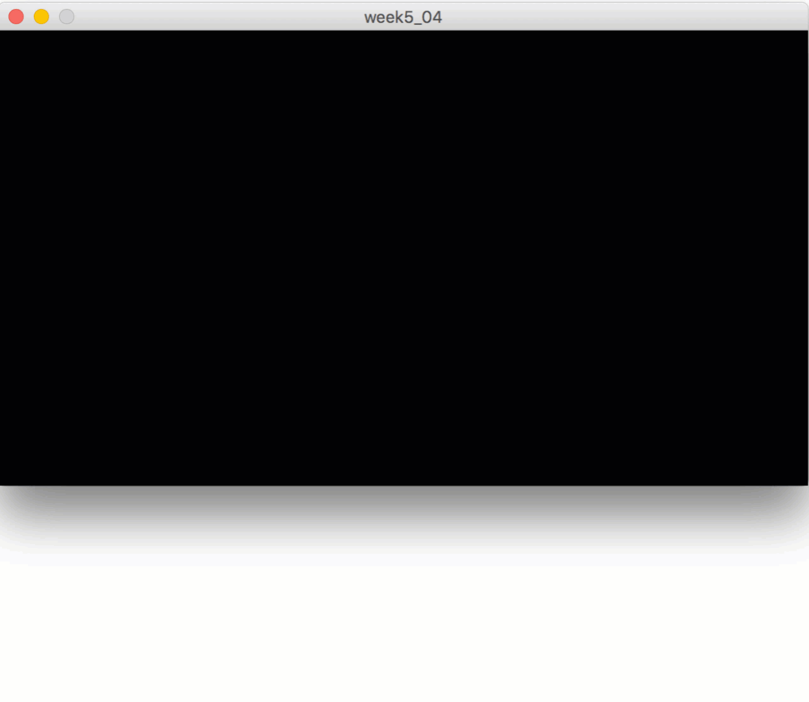

# Exercise #5 - Loops & Arrays

## Part 1

1.	Open, examine and understand the code in the project [week05_01](../files/exercises/week05_01/week05_01.zip?raw=true).  It (below) demonstrates how 5 circles are drawn across the center of a window using the mouse to determine the ``x`` coordinate of the circles.  Importantly, the `x` values are stored in an array.

	

1.	Create a new project called `week5_02` that draws 5 circles down the middle of a 640 x 360 window and use the mouse to determine the ``y`` coordinate of the circles.  Store the `y` values in an array called `circleY[]`.  It should look like this:

	

1.	Create a new project called `week5_03` that draws 5 circles anywhere within a 640 x 360 window and use the mouse to determine the ``(x,y)`` coordinate of the circles.  Store the `x` and `y` values in 2 arrays called `circleX[]` & `circleY[]`.  When the last circle is rendered you must print the [x,y] coordinate of each circle in the console window. It should look like this:

	

1.	Use the solution from `week5_03` above to create a new project called `week5_04` that again draws 5 circles anywhere within the window.  This time you should be able to draw any of the circles using any 1 of 3 possible colours (red, green or blue). **Before** drawing a circle use the keyboard to type a letter - `r` for red, `g` for green or `b` for blue.  You'll need to create a `circleColour[]` array that stores the colour for the circle you will draw next.  It should look like this:

	

## Part 2

1.	Create a new project called `week5_05` that displays 640 x 500 window with a 25 x 25 grid to the left. It draws 5 numbered circles using mouse clicks.  As each circle is drawn various data are being illustrated to the right.  Arrays will be used for your solution.  Your solution should as much as possible look like this:

	

	- You should see a primitive x and y axis.  
	- The origin is at the bottom left corner.  
	- Use the [dist()](https://processing.org/reference/dist_.html) function to calculate the distance from the origin to the mouse click coordinate.
	- Each grid has a width and height of 20 pixels.
	- Arrays should be used to store `x`, `y`, and `distance` values.