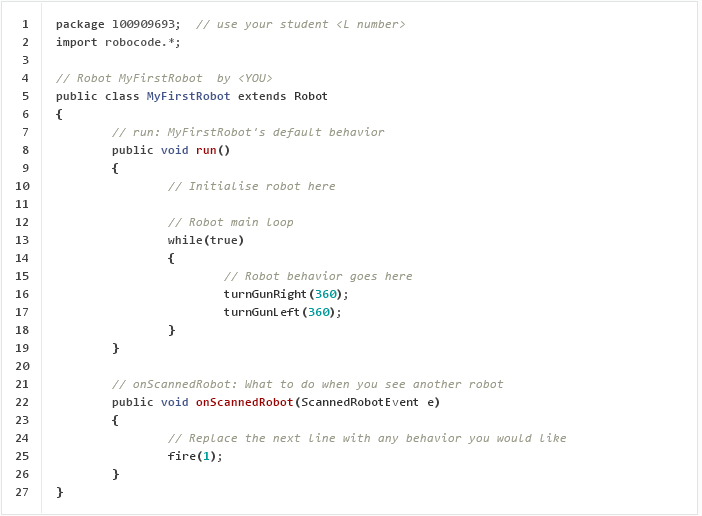

# Week 1

## Exercises
- [Exercise 1 - Running Robocode](#exercise-1---running-robocode)
- [Exercise 2 - Create & Run a Robot](#exercise-2---create--run-a-robot)
- [Exercise 3 - Basic Method Calling](#exercise-3---basic-method-calling)
- [Exercise 4 - Moving the Robot](#exercise-4---moving-the-robot)


## Exercise 1 - Running Robocode

> Complete ALL the exercises in this section.

1.	Start a Battle

	-	Run Robocode	
	-	Start a new battle
	-	Choose the robots *Crazy* and *Corners* to fight in a "1 v 1" battle
	-	Set the Number of Rounds to 3
	-	Set the battlefield size to 800 x 800
	-	Start the battle
	-	Try pausing the battle
	-	Try changing the battle speed using the slider bar at the bottom

	
2.	Melee Battle

	A melee battle is where there are multiple robots competing.

	-	Run Robocode
	-	Start a new battle 
	-	Choose all the robots from the *sample* package.
	-	Set the Number of Rounds to 3
	-	Set the battlefield size to 800 x 800
	-	Start the battle

	Observe the different movements of each robot. Is there a robot with movement you'd like to use in your robot? At the end of the 3 rounds you should see the overall results. Are there any robots that do well consistently?


3.	What is the name of the pink coloured robot?

	
4.	Which of all the *sample* robots tends to consistently win Melee battles?


## Exercise 2 - Create & Run a Robot

> Complete ALL the exercises in this section.

1.	Follow these steps to write the Java code for your own robot.

	-	Choose: ``Robot > Source Editor`` to launch the Robocode editor
	-	Choose: ``File > New > Java File``
	-	Type this program (``MyFirstRobot.java``) code into the editor:

		

	-	Save your code: ``File > Save``
	-	The package (folder) name and filename will be used from the code.
	-	Compile your code: ``Compiler > Compile``.  Fix any errors.


2.	Follow these steps to test your robot in a battle:

	-	Start a battle
	-	Add your new robot ``MyFirstRobot`` and the sample robot ``Walls``
	-	Run 3 rounds

	Observe and understand the behaviour of your robot.


## Exercise 3 - Basic Method Calling

> Complete ALL the exercises in this section.

1.	Change the colours of your ``MyFirstRobot``.  Make the body red, the gun blue and the radar white.
	Run your robot in a battle to see these changes and see the different robot parts.

2.	Using only the method [setColors()](http://robocode.sourceforge.net/docs/robocode/robocode/Robot.html#setColors(java.awt.Color,%20java.awt.Color,%20java.awt.Color)) change the colours of your robot body to green , the gun blue and the radar white.
	Run your robot in a battle to see these changes and see the different robot parts.


3.	Above you changed values (arguments) passed to different ``setColor()`` methods.  
	Here you will change values passed to some other methods.

	Change the arguments passed to ``turnGunRight()`` and ``turnGunLeft()`` from ``360`` to ``180``:


	```java
		turnGunLeft(180);
		turnGunRight(180);

	```

	Run the code to observe the output.


3.	Change the arguments passed to:

	```java
		turnGunLeft(90);
		turnGunRight(90);

	```

	Run the code to observe the output.


4.	Change the arguments passed back to:

	```java
		turnGunLeft(360);
		turnGunRight(360);	

	```

5.	Change the argument passed to ``fire()`` to ``3``:

	```java
		fire(3);

	```

	Run the code to observe the output.  You should see a high powered bullet being fired.


6.	Change the value passed to ``fire()``:

	```java
		fire(0.1);

	```

	Run the code to observe the output.  You should see a low powered bullet being fired.
	
	Notice how the data type above is not a integer value (``int``), it's a ``double`` value.  
	This is fine because the data type the ``fire()`` method expects is ``double``.
	
	[See [fire()](http://robocode.sourceforge.net/docs/robocode/robocode/Robot.html#fire(double))]

		

7. 	Declare and intialise the following variable ``degrees`` in the ``run()`` method and use it in the turn methods:

	```java
		public void run() 
		{
			// Initialise robot here
			double degrees=360.0;
			
			// Robot main loop
			while(true) 
			{
				// Robot behavior goes here
				turnGunRight(degrees);
				turnGunLeft(degrees);
			}
		}

	```

	Run the code.

	
8. 	Change the value of the ``degrees`` variable to some different value, run the code and observe the output.


9. 	Add a ``double`` type variable called ``power`` to the ``onScannedRobot()`` method and use it in the ``fire`` method. Initialise the variable to ``3.0``, the maximum bullet power.

	```java	
		public void onScannedRobot(ScannedRobotEvent e) 
		{			
			???????????? // power variable goes here 
			fire(power); // using the power variable
		}	

	```	
	
	Run the code.  

	

10.	Restore the values of the ``degrees`` and ``power`` variables to ``360`` and ``1`` respectively.

11.	What is the name of the Robocode class that has the methods:

	- ``turnGunLeft()``
	- ``turnGunRight()``
	- ``fire()``

		
12.	Most methods in the Robocode ``Robot`` class use which data type?


13.	Which one of these statements are invalid?

	```java
	turnGunLeft(0);
	turnGunLeft(0.0);
	fire(1);
	turnGunRight("0.0");		
	fire(3*3);
			
	```


## Exercise 4 - Moving the Robot

> Complete ALL the exercises in this section.


1.	Add the following code to your ``run()`` method in ``MyFirstRobot``

	```java
		public void run() 
		{
			while(true) 
			{
				turnRight(90);
				turnGunRight(360);
			}
		}
	
	```

	Run the code to see the behaviour.  Notice the robot turning 90 degrees before turning the gun around.
	
	

2.	Change the degrees argument in ``turnRight()`` above to some different values like:

	```java	
		turnRight(180);
		
	```
		
	and run the code to see the behaviour.
	
3.	Replace ``turnRight()`` with ``turnLeft()`` and run the code to see the behaviour.

4.	Add the following code to your ``run()`` method:

	```java
		public void run() 
		{
			while(true) 
			{
				ahead(600);
				turnRight(180);
			}
		}

	```

	and run the code to see the behaviour.
	

5.	Add the following code to your ``run()`` method to make the robot move in a square:

	```java
		public void run() 
		{
			while(true) 
			{
				ahead(100);
				turnRight(90);
				ahead(100);
				turnRight(90);
				ahead(100);
				turnRight(90);
				ahead(100);
				turnRight(90);
			}
		}

	```

	and run the code to see the behaviour.

	
6.	Add the variable ``distance`` to your ``run()`` method and update the code in ``ahead()`` to use it.

	```java
		public void run() 
		{
			double distance=100;
			
			while(true) 
			{
				ahead(...);
				turnRight(90);
				ahead(...);
				turnRight(90);
				ahead(...);
				turnRight(90);
				ahead(...);
				turnRight(90);
			}
		}

	```

	Run the code to see the behaviour.


7.	Add a variable ``degrees`` to your ``run()`` method and use it in the ``turnRight()`` method.

	```java
		public void run() 
		{
			double distance=100;
			double ...
			
			while(true) 
			{
				ahead(...);
				turnRight(...);
				ahead(...);
				turnRight(...);
				ahead(...);
				turnRight(...);
				ahead(...);
				turnRight(...);
			}
		}

	```

	Run the code to see the behaviour.
	

8.	Examine the code inside the ``while`` loop above.  It has repetitive code. A ``for`` loop could achieve the same result. Update you code to use it:

	```java
		public void run() 
		{
			double distance=100;
			double degrees=90;
			
			while(true) 
			{
				for(int i=0;i<4;i++)
				{
					ahead(distance);
					turnRight(degrees);
				}
			}			
		}

	```

	Run the code.
	
9.	Update the code in ``run()`` to include a new variable ``clockwise`` that is used in an ``if`` statement like this:

	```java
		public void run() 
		{
			double distance=100;
			double degrees=90;
			boolean clockwise=true;

			while(true)
			{
				for(int i=0;i<4;i++)
				{
					ahead(distance);
					if(clockwise==true)
						turnRight(degrees);


				}
			}	
		}
	
	```

	Run the code.
	

10.	Update the code in ``run()`` to turn left when ``clockwise`` is set to false as shown here:

	```java
		public void run() 
		{
			double distance=100;
			double degrees=90;
			boolean clockwise=false;

			while(true)
			{
				for(int i=0;i<4;i++)
				{
					ahead(distance);
					if(clockwise==true)
						turnRight(degrees);
					...
						...
				}
			}	
		}
	
	```

	Run the code.	
		
	```java
		if(clockwise==true)
			turnRight(degrees);
		else
			turnLeft(degrees);

	```


11.	Update the code in ``onScannedRobot()`` to get the current energy level of your robot before you fire.
	The ``energy`` variable will store the current energy level.

	```java
		public void onScannedRobot(ScannedRobotEvent e) 
		{
			double energy=getEnergy();  // puts energy level into energy variable
			
			fire(1);		
		}	
			
	```

12.	Update the code in ``onScannedRobot()`` so your robot will fire different power bullets depending on the robot's energy level.  If the robot has more than 75 units of energy fire bullets with power of ``3`` otherwise fire bullets with a power of ``1``.
	
	Run your robot to test this works.


13.	Examine the code added to the ``run()`` method here:
	
	```java
		public void run() 
		{
			double distance=100;
			double degrees=90;
			boolean clockwise=true;
			double energy=getEnergy();

			while(true)
			{
				energy=getEnergy();  // get robot's current energy level
				
				// change colour of body based upon energy level
				...
				...
					
				for(int i=0;i<4;i++)
				{
					ahead(distance);
					if(clockwise==true)
						turnRight(degrees);
					else
						turnLeft(degrees);
				}
			}	
		}
		
	```

	Before the ``for`` loop write the code to implement the following behaviour:
	
	* if the energy level is more than 50 make the robot body colour *green*
	* if the energy level is between 26 to 50 make the robot body colour *orange*
	* if the energy level is 25 or less make the robot body colour *red*
	
	Run your robot to test this behaviour works.

