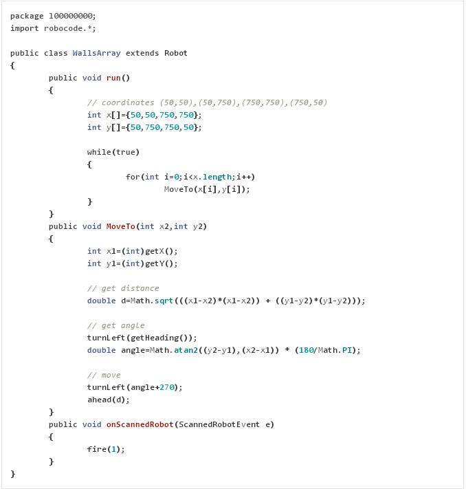

# Week 3

> You MUST complete ALL Week 1 exercises before attempting these exercises

- [Exercise 1](#exercise-1)
- [Exercise 2](#exercise-2)
- [Exercise 3](#exercise-3)
- [Exercise 4](#exercise-4)


## Exercise 1

> Complete ALL the exercises in this section.

1.	Using the formula outlined earlier, calculate the *distance* between the points (0,0) and (800,0). What is the distance?  Note your answer.

1.	Calculate the distance between the points (0,0) and (800,600). 	Note your answer.

1.	Calculate the *angle* between the points (0,0) and (800,0).  What is the angle? 

1.	Calculate the *angle* between the points (0,0) and (800,800).  

1.	Create the robot ``CenterBot`` with the code shown below.  This robot uses the distance and angle formulae to move to the center of a 800x800 battlefield.	

	

	Compile, run and view this robot using a 800x800 battlefield.

1.	Create the robot ``CenterBotV2`` with the code shown below.
	
	
		
	This robot has a method called ``MoveTo()`` that can be used to move your robot anywhere. 
	This is a very useful and reusable method. 
	
	Compile, run and view this robot using a 800x800 battlefield.

1.	Modify ``CenterBotV2`` that when it reaches the middle of the battlefield it then moves continuously around the perimeter of the safe zone as shown in below.  Use a *Sentry Border Size* of 200 and in the *View Options* section enable *Visible Sentry Border*.

	
	
	Compile, run and test your robot using a 800x800 battlefield.


## Exercise 2

> Complete ALL the exercises in this section.

1.	Create a new robot called ``SafeZoneCorner`` that 
	
	- moves to bottom-left corner of the safe-zone permanently
	- orientates itself north	
	- and moves its gun continuously along the 90 angle arc as shown below.

	Download and setup the ``SentryBot`` robot from the link on BlackBoard.
		
	

	Compile and run this robot using a 800x800 battlefield.
	
1.	In a previous exercise you made the robot ``CenterBotV2`` move around the corners of a 800x800 
	battlefield with this code:
	
	```java
	while(true)
	{
	   MoveTo(50,50);
	   MoveTo(50,750);
	   MoveTo(750,750);
	   MoveTo(750,50);
	}

	```		
	
	Create a new robot `WallsArray` with the code shown in `WallsArray.java` below.  
	It uses an array to store the corner coordinates and then uses it in the ``MoveTo`` methods to move 
	clockwise around the corners.
	
	Compile and run this robot using a 800x800 battlefield.

	
		
1.	Using the same arrays modify the code in ``WallsArray`` to make it move continuously around the perimeter of the safe zone as shown below:
	
	Ensure it is not being damaged by SentryBots.	

	
		
1.	Modify the code in ``WallsArray`` to make it move anti-clockwise around the perimeter of the safe zone.  
	Again use the array.
		

## Exercise 3

1.	Go to the Robot class methods [here](http://robocode.sourceforge.net/docs/robocode/robocode/Robot.html#method_summary)	and read about all the event handler methods it has.  Event handler methods begin with the word ``on``. For example, ``onBulletHit()``
	
1.	Robocode is an event driven environment.  When a robot hits another robot or when a robot gets hit by a bullet, this is known as: 
	
	- a handler
	- a method
	- an event
	
	(Choose one)
	
1.	``ScannedRobotEvent`` is the event for when a robot scans another robot?

	- true
	- false
	
1.	``BulletHitEvent`` is the event for when your robot gets hit by a bullet.	

	- true
	- false
	
1.	What code statement is missing below?

	```java
	public void onScannedRobot(... event)
	{
	   fire(3);
	}
	
	```

	Is it:	

	- ``ScannedEvent``
	- ``ScannedRobotEvent``
	- ``ScannedRobot``
		
1.	What event handler method name is missing below?

	```java
	public void ...(HitRobotEvent event)
	{
	   fire(3);
	}

	```

1.	Which of these are valid event handler methods?

	- ``onScannedRobot()``
	- ``onBulletMissed()``
	- ``onBulletHit()``
	- ``onDeath()``
	
1.	Create a robot called ``Week3Robot1`` with this code:

	```java	
	package l????????;  // your student number goes here

	import robocode.*;

	// Week3Robot1 - (your name here)

	public class Week3Robot1 extends Robot
	{
	   public void run() 
	   {
	      while(true) 
	      {
	         ahead(800);   		         
	      }
	   }
	   public void onScannedRobot(ScannedRobotEvent event)
	   {
	      fire(1);
	   }
	}	

	```

	Add this code (**event handler**) to handle the event of hitting a wall:
	
	```java
	public void onHitWall(HitWallEvent event) 
	{
	   back(10);       // back 10 pixels
	   turnRight(180); // and turn around
	}

	```

	Make sure you put this event handler in the correct location inside the program. Start a new battle and observe it's behaviour.  When it hits a wall it should turn around.
		
1.	Modify your robot code to print the message "Ouch!" to the console window every time your robot is hit by a bullet.
	
	Start a new battle and observe it's behaviour.
	
1.	Modify you robot code again.  Let's write some code to adjust the fire power of your robot's bullets based upon the accuracy of your firing.  If your firing accuracy is good the firepower is increased but if it is bad the firepower is decreased. 

	Follow these steps:
	
	(a)	Declare a ``double`` variable called ``firepower`` and intialise to ``2.0``. Declare it before the ``run()`` method:
	
	```java
	double firepower=2.0;

	public void run() 
	{
		...
	}
	```

	(b)	Modify your ``onScannedRobot()`` method to use this new variable:
	
	```java
	public void onScannedRobot(ScannedRobotEvent event) 
	{
		fire(firepower);
	}
	```

	(c)	Modify your robot code to include the method handler called when one of your bullets hits another robot. Within that method increment your firepower by 0.5
		
	(d)	Modify your robot code to include the method handler called when one of your bullets misses another robot.  Within that method decrement your firepower by 0.5
	
	Compile and test this new behaviour.


## Exercise 4

1.	Go to the Robot class methods [here](http://robocode.sourceforge.net/docs/robocode/robocode/Robot.html#method_summary). Can you find and read the documentation about the following event classes?
	
	- ``ScannedRobotEvent``
	- ``BulletHitEvent``
	- ``HitByBulletEvent``
	
	These classes and others contain useful methods that you may want to use in your code.
	
1.	Create a robot called ``Week3Robot2``  with this code:

	```java	
	package L????????;  // your student number goes here

	import robocode.*;

	// Week3Robot2 - (your name here)

	public class Week3Robot2 extends Robot
	{
	   public void run() 
	   {
	      MoveTo(400,400);
	      while(true) 
	      {
	         turnGunRight(360);   		         
	      }
	   }		   
	   public void MoveTo(int x2,int y2)
	   {
	      // set current & destination locations
	      int x1=(int)getX();
	      int y1=(int)getY();		      

	      // get distance
	      double d=Math.sqrt(((x1-x2)*(x1-x2)) + ((y1-y2)*(y1-y2)));

	      // get angle
	      turnLeft(getHeading());  // align robot to 0
	      double angle=Math.atan2((y2-y1),(x2-x1)) * (180/Math.PI);

	      // turn & move
	      turnLeft(angle+270);
	      ahead(d);
	   }
	}	

	```

	Add this event handler that uses the event class ``ScannedRobotEvent`` to determine if scanned robots are SentryBots before firing.	
	
	```java
	public void onScannedRobot(ScannedRobotEvent event)
	{
	   boolean sentryRobot = event.isSentryRobot();
	   if(!sentryRobot)
	      fire(1);       // only fire if not a sentry robot
	}	   
	```

	Start a new battle using **this robot** versus **SentryBot** versus **1 sample robot**. 
	Observe it's behaviour. It should not fire at SentryBot.

1.	Once an opponent has been scanned you can use the ``ScannedRobotEvent`` class methods to determine 
	more data about the event itself.  
	For example, this code shows how to get the distance to the opponent, using the ``getDistance()`` method 
	and adjusts its firing strategy.  
	
	```java	
	public void onScannedRobot(ScannedRobotEvent event)
	{	   		
	   boolean sentryRobot = event.isSentryRobot();
	   double distance;		
		
	   if(!sentryRobot)
	   {
	      distance=event.getDistance();	// get distance to opponent
	      if(distance>200)				// if more than 200 pixels away
	         fire(1);
	      else 
	         fire(3);
	   }			
	}
		
	```

	Update ``Week3Robot2.java`` to include this code.
	Start a new battle using **this robot** versus **SentryBot** versus **1 sample robot**.
	Observe it's behaviour.  	

1.	The battle format is always **your robot** versus **SentryBot** versus **another robot**.

	Update the code in the ``onScannedRobot()`` method to change the colour of your robot depending on its energy compared to your direct opponent.
	If your robot has more energy than an opponent change its body colour to *green* otherwise change the body colour to *red*.

	You need to find the correct method in the class ``ScannedRobotEvent`` to get your opponent's energy.
	Update your ``Week3Robot2.java`` robot to do this after firing.  	
	
	Start a new battle using **this robot** versus **SentryBot** versus **1 sample robot**.
	Observe it's behaviour.  
	Your robot's colour should adjust depending on it's energy.

1.	Add the *event handler* ``public void onHitByBullet(HitByBulletEvent event)`` to your ``Week3Robot2`` robot code as shown below:

	```java
	public void onScannedRobot(ScannedRobotEvent event)
	{	   		
	   ...
	   ...
	   ...
	}

	public void onHitByBullet(HitByBulletEvent event)
	{
	}
		
	```		

	This method is called when your robot is hit by a bullet.
	It has a method parameter ``event`` that is an instance of the ``HitByBulletEvent`` class.
	You can use this parameter to get more information about the bullet that hit your robot.	
	
	(a)	Print to the console the power of the bullet that hit you.

	(b)	Print to the console the name of the robot that hit you with a bullet.
	
	(c)	If the robot that hit you with a bullet was not a SentryBot change your body colour to yellow.
	
	Start a new battle using **this robot** versus **SentryBot** versus **1 sample robot**.
	Observe it's behaviour.  
	
1.	Add the *event handler* ``public void onBulletHit(BulletHitEvent event)`` to your robot code as shown below:

	```java
	public void onScannedRobot(ScannedRobotEvent event)
	{	   		
	   ...
	   ...
	   ...
	}

	public void onHitByBullet(HitByBulletEvent event)
	{
	   ...
	   ...
	   ...
	}
	
	public void onBulletHit(BulletHitEvent event)	
	{
	}

	```

	This method is called when your robot hits another robot with a bullet.
	It has a method parameter ``event`` that is an instance of the ``BulletHitEvent`` class.
	You can use this parameter to get more information about your bullet that hit your opponent.
	
	Search the [Robot documentation](http://robocode.sourceforge.net/docs/robocode/robocode/Robot.html) for the class ``BulletHitEvent``.  Get the (x,y) coordinate of the bullet and move your robot to that location.	
	
	Start a new battle using **this robot** versus **SentryBot** versus **1 sample robot**.
	Observe it's behaviour.  
	Your robot should move towards an opponent when it hits it with a bullet.
	
